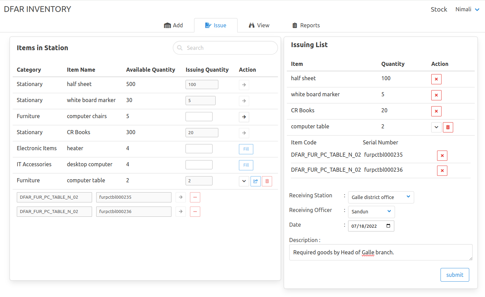
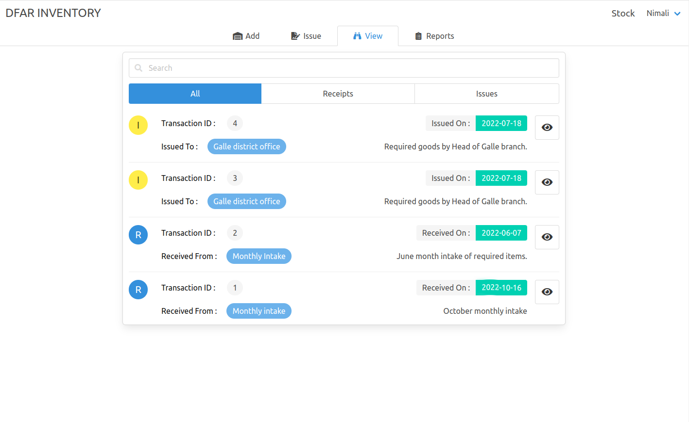

## Multi-Station Inventory
Custom inventory system that can manage resources in multiple locations. Project originally designed for the Department of Fisheries and Aquatic resources, Sri Lanka.

## Key features

- Separate account for each location(station)
- Multiple user accounts for each station
- Real-Time inventory tracking
- Manage life-cycle of long-lived items (eg:- Tables, special process for adding/removing items)
- Manage items that can be issued in bulk (eg:- A4 Sheets)
- Generate PDF documents for every transaction
- Search, Filter, Ordering features
- Ability to view all past transactions
- Ability to generate reports for a desired time frame and save them as PDF documents
- Feature rich Admin panel

## Environment

Ubuntu 22.04

Docker version 27.3.1, build ce12230

### How to use

1. Download the project from GitHub
2. Go to project folder, open a new terminal and run `docker compose up -d` be patiant till finish (use `docker compose logs -f` to check progress)
3. That's it! Go to `localhost:8000` on your browser and see.

### Screenshots

